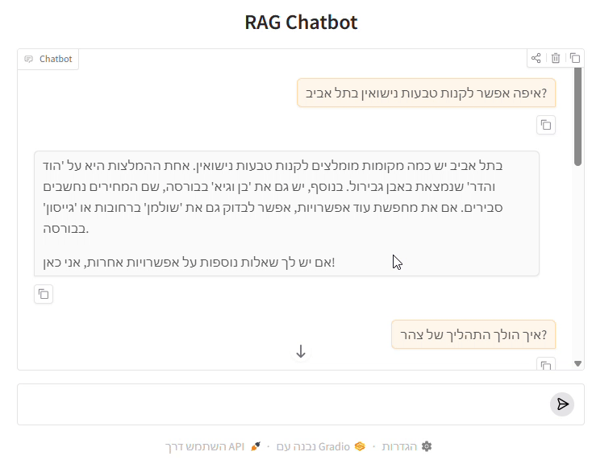

# 🤵 Wedding Planner Chatbot

## Overview
This project is a Wedding Planner Chatbot leveraging a specialized Retrieval-Augmented Generation (RAG) architecture. It is designed to assist users by providing context-aware recommendations and responses based on complex user queries. The core strength of this system lies in its sophisticated custom data pipeline, which transforms noisy, multilingual WhatsApp group chats into a structured, highly queryable knowledge base.

Below is an example of the chatbot in action:



## Features
- **Vector Database**: Efficient storage and retrieval using FAISS (or your chosen library) for rapid semantic search.
- **Adaptive Retrieval**: Uses a multi-stage retrieval process with topic expansion and metadata filtering to deliver more accurate and relevant results.
- **Prompt Management**: Stores and manages prompt templates for consistent chatbot behavior.
- **Context-Aware Generation**: Generates comprehensive, nuanced responses based on the retrieved context and conversation history.
- **Prompt Management**: Standardized templates (Prompts.py) ensure consistent chatbot persona and behavior.

## 🧠 Custom Data Pipeline and Retrieval Architecture (Technical Innovation)
The RAG system achieves high retrieval accuracy by performing intensive, non-standard preprocessing on the raw chat data, creating a knowledge base significantly superior to systems that rely on processing standard text chunks.
### The Challenge: Noise and Context Loss
The raw WhatsApp data presents unique RAG challenges: it is inherently noisy, featuring interleaved discussions on multiple topics within the same timeframe, and the lack of explicit "reply-to" functionality obscures conversational flow. Standard RAG techniques using a fixed context window fail here because they often mix unrelated topics, leading to poor context retrieval.

### Our Solution: The Topic Window Approach
To address this, the system implements a topic window approach for accurate context segmentation.
1. Initial Cleaning & Topic Inference: Raw transcripts are first cleaned via keyword filtering. A specialized Topic Agent then processes messages within a window of time. The agent classifies each individual message based on its relevance to a pre-defined list of wedding topics.
2. Handling Ambiguity: Messages that are too general (e.g., "Hi," "LOL") are classified as General. Messages that the agent cannot confidently classify are tagged as Unknown. This "Unknown" tag provides a hook for a human-in-the-loop process, enabling manual classification of complex entities (like new vendors) and continuous model refinement.
3. Continuous Threading: Messages belonging to the same primary source_topic and occurring within the same period are unified into a continuous chat thread. This action effectively reconstructs the conversation around a single subject (e.g., all messages about "Venue").

### Structured Metadata Enrichment: 
Following this segmentation, the pipeline generates high-quality structured data:
* A summary of each reconstructed thread is generated to serve as the core page_content.
* Crucial entities-names, locations, and the primary source_topic- are extracted via NER and stored as metadata alongside the vector embeddings.


## Setup Instructions
1. Clone the repository to your local machine.
2. Install the required libraries using the following command:
   ```powershell
   pip install pandas numpy faiss-cpu scikit-learn jupyter gradio langchain_openai langchain_community sentence_transformers
   ```
3. Fill the configuration file with your desired settings (API keys, vector file path, etc.).
4. Data Preprocessing (CRITICAL STEP): Run the preprocessing scripts to build the vector index
   ```powershell
   python Preprocess/Preprocessing.py
   ```
   Note: For debugging and quality control, it is highly recommended to run the preprocessing functions step-by-step in the notebook (preprocessing.ipynb). This allows for manual inspection and correction of synthesized summaries and entity tags, which is vital for maintaining data quality and high retrieval performance.
5. Launch the main application. If the vector file does not exist or is not specified in the configuration, it will be created automatically. 

## Project Structure

```
Main.py                 # Entry point for the application
Agent.py                # Main agent logic for the chatbot
Config.py               # Configuration settings for the application
Generation.py           # Handles response generation
Prompts.py              # Stores prompt templates for the chatbot
Retrieval.py            # Implements retrieval mechanisms for relevant data
VectorStore.py          # Manages vector storage for efficient data retrieval

Preprocess/             # Scripts for data preprocessing
  Create_Data.py        # Script to create datasets
  Preprocessing.py      # Script to preprocess data
  preprocessing.ipynb   # Jupyter notebook for experimentation and testing

## Acknowledgments
Datasets are sourced from various wedding planning WhatsApp groups.